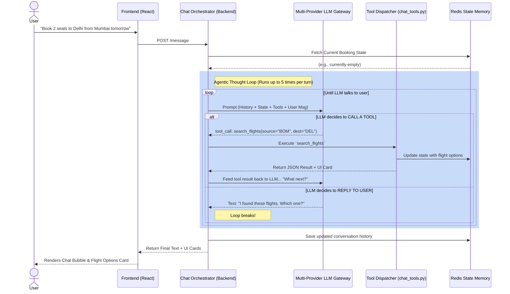

# How the Agentic AI Works

This document explains the "Agentic" part of AirlineBookings. Unlike a traditional chatbot that just takes text and returns text, this agent runs in a **Reasoning and Acting (ReAct) Loop**. 

It can autonomously decide to perform multiple background actions before it ever replies to the user.

## The Agentic Loop (Mermaid Diagram)

## How does it decide what to do next?

The LLM doesn't have a hardcoded script (like an `if/else` tree). It decides dynamically based on three things:

### 1. The Ground-Truth State
In a normal chatbot, the AI has to read the chat history to remember what's happening. In this app, the backend maintains a strict JSON state in Redis (`chat_session.py`). Every time the user speaks, the orchestrator injects this state into the system prompt:
> *"Current State: 2 Passengers expected. 0 added so far. Flight 6E-123 selected."*

When the LLM sees this, it logically deduces: *"Ah, I need to ask for passenger details next."*

### 2. Tool Descriptions (The Rules)
The LLM is given a list of tools (functions) it can call. The descriptions of these tools (in `chat_tools.py`) act as the "rules of the game".
For example, the description for `confirm_booking` explicitly says:
> *"Call review_booking first and get the traveler's go-ahead before confirming."*

The LLM reads this and knows it is literally not allowed to book a flight until it has called the review tool and received a "yes" from the user.

### 3. The ReAct Architecture (Reason -> Act -> Observe)
When the LLM calls a tool, the execution pauses. The backend runs the Python code, gets the data (e.g., a seat map), and hands that data back to the LLM. 
The LLM then **observes** the result. 
- If the tool failed (e.g., "Seat 4A is already taken"), the LLM observes the error and decides to call the tool again with a different seat, or apologize to the user and ask them to pick another.
- If it succeeded, it might move to the next logical step, or simply stop and reply to the user.